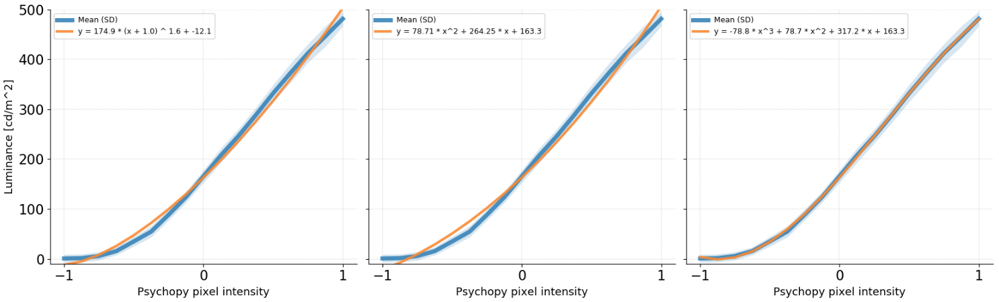

# psychophysics

Plot and model projector luminance for visual neuroscience experiments.

Projector luminance (measured with a photometer) plotted as a function of
psychopy pixel intensity. Several functions are fitted to the data.

Use @MSchnei's [script](https://gist.github.com/MSchnei/bd282b1dbce85431ee61bbd955574279) for the luminance measurement.
